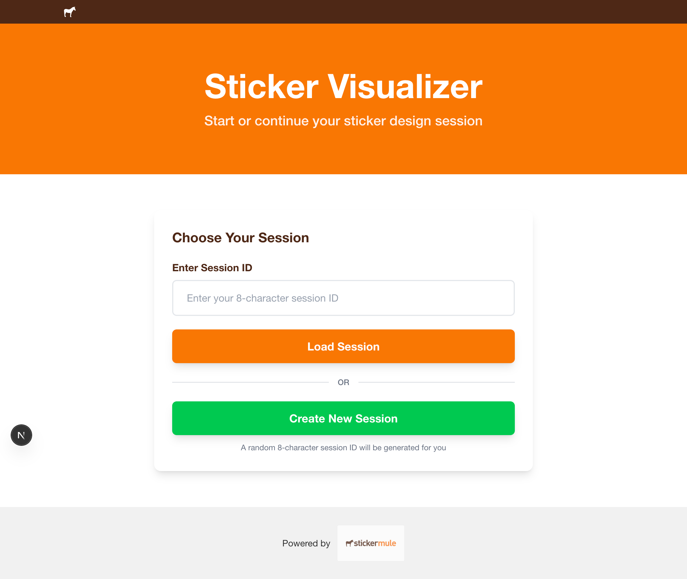
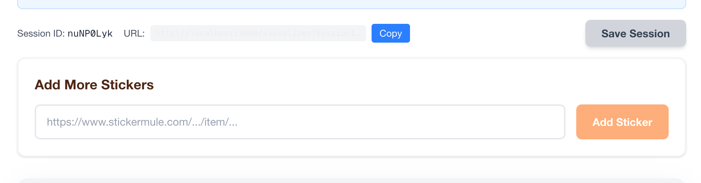
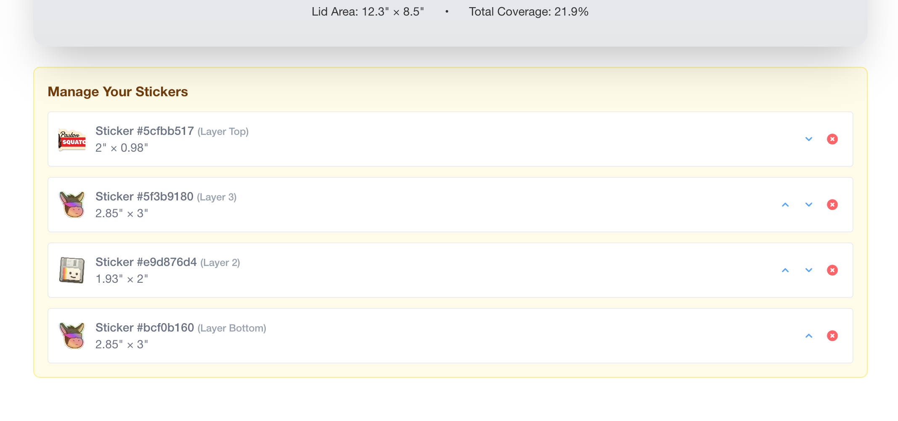

# Interactive Sticker Visualizer

A Next.js application that allows users to visualize and arrange stickers on a MacBook Pro laptop. Users can create sessions, add multiple stickers, drag them around, and save their arrangements.

## Features

- **Session Management**: Create new sessions or load existing ones with 8-character session IDs
- **Drag & Drop**: Interactive sticker placement on a MacBook Pro mockup
- **Layer Management**: Reorder stickers (bring to front/send to back)
- **Session Saving**: Save sticker arrangements with positions
- **URL Sharing**: Copy session URLs to share configurations

## Screenshots

### Landing Page

*Choose to enter an existing session ID or create a new session*

### Visualizer Interface

*Main visualizer interface showing stickers on MacBook Pro*

### Session Management

*Session ID display and URL copying functionality*

### Sticker Management

*Layer management and sticker controls*

## Tech Stack

- **Frontend**: Next.js 15 with TypeScript
- **Backend**: Go webserver
- **Styling**: Tailwind CSS
- **Deployment**: Docker + Google Cloud Platform
- **Database**: Postgresql

## Key Components

### Session Management
- **Session ID Generation**: 8-character alphanumeric IDs
- **URL Parameters**: Sessions accessible via `?sessionId=ABC123XY`
- **Persistence**: Save/load sticker arrangements

### Sticker Visualizer
- **Interactive Canvas**: MacBook Pro background with draggable stickers
- **Real-time Positioning**: Live coordinate tracking
- **Size Calculations**: Coverage percentage display
- **Layer Control**: Z-index management for overlapping stickers